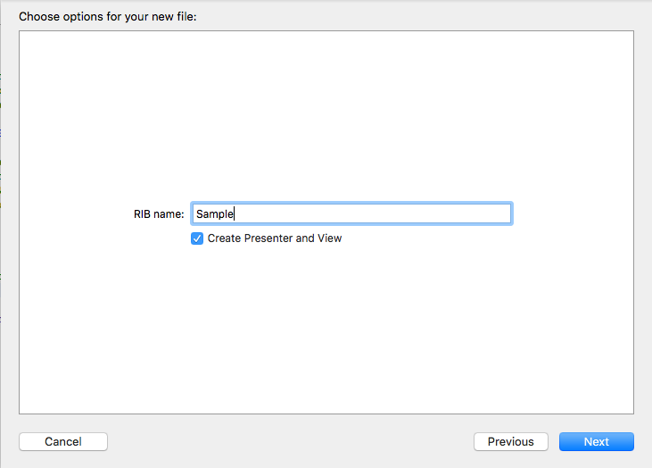
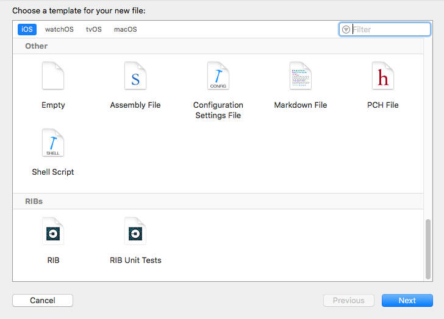

# RIB Xcode Templates

We have created Xcode templates to generate RIBs scaffolding, making RIB usage and adoption easier. The scaffolded classes have RIBs wired up, ready to add business logic to them.

After installing templates, RIBs can be added with the `New File...` command in Xcode. This generates:
- [RIBName]Builder, [RIBName]Interactor, [RIBName]Router classes in all classes
-  and [RIBName]ViewController class

RIBs can be generated with or without Presenter and View classes.

## Installation Instructions

Run the `install-xcode.template.sh` shell script to copy the templates to the Xcode templates folder. Once you have successfully copied the templates, when adding a new file in Xcode, the RIBs group will show up.

.
